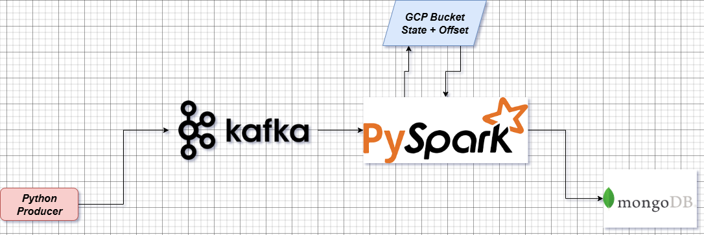
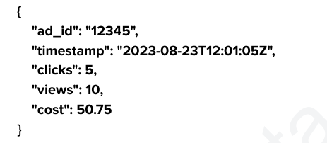
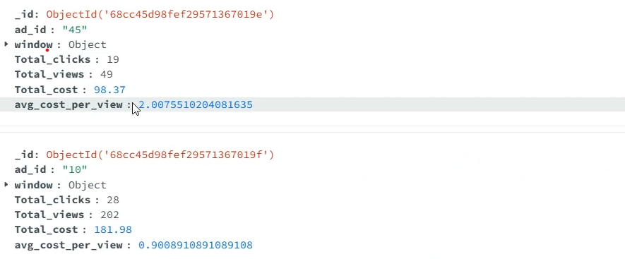

# “Real-Time Ad Analytics Pipeline with Kafka, Spark, GCP Dataproc and MongoDB”

### Brief Description

This project implements a real-time streaming data pipeline for online advertisement analytics.

### Prerequisites
- Python 3.11.8
- Confluent Kafka
- Hadoop + Pyspark 
- GCP Dataproc
- GCP Bucket
- MongoDB

A Kafka python producer generates mock ad events containing ad_id, timestamp, clicks, views, and cost, and streams them into a Kafka topic.

And our end goal is to get certain statistics about the advertisements shown below.

The goal is to process this real-time data, compute business insights using **window-based aggregation**, and write the aggregated results into a **MongoDB**.  The aggregation key is **ad_id**
The python script has 50% chance to publish duplicate data of an ad so that we can groupBy those ads and perform aggregrations such as

- count
- sum
- avg
- Avg Cost Per View

**Records are published into kafka topic in avro serialized format**
You can find the Data Contract [HERE](schema.avsc)

After that a **Spark Structured Streaming Job** subscribes to the kafka topic, and deserialize the data applies **window-based aggregations** (1-minute window size with 30-second slide interval), and computes key metrics such as:
- Total clicks
- Total views
- Total cost
- Average cost per view

### Important thing Noticed

Deserializing data from avro format is not a simple task in spark, normal deserialize does not work here. Confluent Avro messages have a magic byte (0) and a 4-byte schema ID prefix at the start. That’s 5 bytes in total. So we had to extract the actual data part without the 5 bytes. You can see it in the spark job [HERE](spark-job2.py)

Confluent kafka is a python package so we have to download the appropriate .whl file and pass it as well. The .whl file can be found [HERE](confluent_kafka-2.11.1-cp311-cp311-manylinux_2_28_x86_64.whl)
When runnning the spark job on the local machine using **python spark-job2.py** I faced no problems. But when I wanted to run it on the master node in Dataproc using 
**spark-submit --master yarn**
  **--deploy-mode client**
  
it did not work I had to install the following  in the master node

- **python3 -m pip install confluent_kafka-2.11.1-cp311-cp311-manylinux_2_28_x86_64.whl**
- **python3 -m pip install orjson**
- **python3 -m pip install httpx**
- **python3 -m pip install authlib**

Only after installing these the spark job ran without problem in master node in dataproc.

** I have also maintained **Checkpoint** in **GCP Bucket** which holds the **states and offsets**.

Finally the data is put inside a MongoDB collection.
If you watch the video you might see duplicate records in mongodb that is because a record can fall under multiple time windows.
For example:
- An event at 12:00:20 belongs to the window [12:00:00, 12:01:00)
- It also belongs to the window [12:00:30, 12:01:30)

This is another small Real Time streaming project i have created to showcase my Spark and GCP knowledge mainly for my journey towards Data Engineering.

If you want to see a full video of the code working you can see it on my linkedin post [HERE]()

